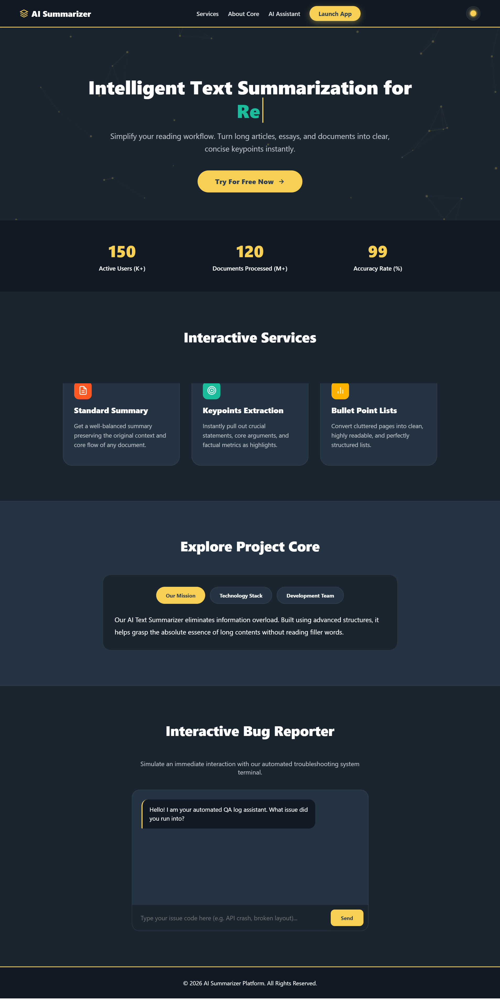

# AI-Powered Text Summarizer

An AI-powered web application that uses an API to generate concise and meaningful summaries from long texts.

## 📌 About The Project

AI-Powered Text Summarizer is a web-based application designed to help users quickly understand long pieces of text.

Users can enter their text into the chatbot interface, and the application processes the text through an AI API and displays a concise summary.

## ✨ Features

- AI-powered text summarization
- Chat-style user interface
- Responsive design
- API integration
- Dynamic interaction using JavaScript
- Error handling
- Simple and user-friendly interface

## 🛠️ Technologies

- HTML5
- CSS3
- Bootstrap
- JavaScript
- AI API
- Git & GitHub

## 👥 Team Members & Responsibilities

### Elhama Daneshyar
- Color palette selection
- Font selection
- Landing page design
- Main page UI/UX

### Satara Timoori
- GitHub repository management
- Chatbot UI design
- Summarizer page HTML/CSS
- Front-end structure and styling

### Samira Habibi & Samanah Quraishi
- JavaScript functionality
- User interactions
- Dynamic content handling
- Front-end functionality

### Mineh Jami
- API integration
- API-related functionality
- Testing
- Bug fixing
- Error handling

## 📸 Screenshots

### Landing Page




### Chat UI

.png)

## 🔗 Project Links

- **GitHub Repository:**  
  [View Source Code](https://github.com/sataratimoori/ai-text-summarizer-api.git)

- **Live Demo:**  
  [Open Live Project](YOUR-LIVE-LINK-HERE)

## 🚀 How It Works

1. The user opens the AI Summarizer website.
2. The user enters or pastes text.
3. JavaScript handles the user interaction.
4. The text is sent to the AI API.
5. The API processes the text.
6. The generated summary is displayed to the user.

## 📂 Project Structure

```text
ai-text-summarizer-api/
│
├── index.html
├── bot.html
├── style.css
├── bot.css
├── script.js
│
├── assets/
│   └── screenshots/
│       ├── landing-page.png
│       ├── summarizer.png
│       └── chat-ui.png
│
└── README.md
